# GPS Trajectory Demo - Architecture

## System Overview

This demo implements a **serverless, event-driven architecture** for real-time GPS trajectory smoothing using Redis Streams, Kalman filtering, and WebSocket-like communication via Server-Sent Events (SSE).

```mermaid
flowchart TD
    Dataset[📦 Geolife Dataset<br/>./archive/<br/>182 users, ~18k trajectories]

    Replay[🎬 Data Replay<br/>data/replay.ts<br/>• Parses PLT files<br/>• Time-scaled replay 10x<br/>• Parallel streaming]

    RedisStream[(💾 Redis Stream<br/>gps:raw<br/>Raw GPS points)]

    Worker[⚙️ Single Worker<br/>worker/gps-worker.ts<br/>Consumer: gps-workers<br/>• Kalman Filter 2D<br/>• Haversine Distance<br/>• Moving Average 1D<br/>• All in one process]

    RedisPubSub[(💾 Redis Pub/Sub<br/>gps:processed<br/>Final output)]

    SSE[📡 SSE Server<br/>client/sse-server.ts<br/>Port: 3002<br/>• Redis subscriber<br/>• EventSource bridge<br/>• CORS enabled]

    Client[🗺️ Web Client<br/>index.html + app.ts<br/>Port: 5173<br/>• Leaflet map<br/>• Dark/Light theme<br/>• Raw vs filtered traces<br/>• Live statistics]

    Dataset -->|Read PLT files| Replay
    Replay -->|XADD| RedisStream
    RedisStream -->|XREADGROUP<br/>Batch: 10 msgs| Worker
    Worker -->|PUBLISH| RedisPubSub
    RedisPubSub -->|SUBSCRIBE| SSE
    SSE -->|Server-Sent Events<br/>text/event-stream| Client

    style Dataset fill:#2d3748,stroke:#4a5568,color:#fff
    style Replay fill:#2b6cb0,stroke:#3182ce,color:#fff
    style RedisStream fill:#c53030,stroke:#e53e3e,color:#fff
    style Worker fill:#2f855a,stroke:#38a169,color:#fff
    style RedisPubSub fill:#c53030,stroke:#e53e3e,color:#fff
    style SSE fill:#d69e2e,stroke:#ecc94b,color:#fff
    style Client fill:#0066cc,stroke:#3182ce,color:#fff
```



---

## Components

### 1. Data Replay (`data/replay.ts`)

**Purpose**: Simulate real-time GPS data stream from historical Geolife dataset

**Key Features**:

- Parses PLT files (lat, lon, altitude, timestamp)
- Time-scaled replay (configurable speed multiplier)
- Parallel trajectory streaming
- Automatic Redis stream creation

**Input**: PLT files from `archive/Geolife Trajectories 1.3/Data/`
**Output**: Redis Stream `gps:raw`

**Message Format**:

```typescript
{
  sensorId: "000-20081023025304",  // userId-trajectoryId
  lat: "39.984702",
  lon: "116.318417",
  timestamp: "1734567890000"       // Current time (not original)
}
```

---

### 2. GPS Processing Worker (`worker/gps-worker.ts`)

**Purpose**: Unified processing pipeline with all stages in one worker

**Architecture**: All processing (Kalman filter, velocity calculation, moving average) runs in a single worker process with one Redis stream consumer. Use `npm run dev:monolith` to run this architecture.

**Processing Flow**:

- Reads raw GPS points (lat, lon, timestamp)
- Applies 2D Kalman filter using dspx
- Calculates time delta (dt) for proper filtering
- Calculates instantaneous velocity using Haversine distance
- Applies 1D moving average to velocity data
- Determines movement status (>0.5 m/s threshold)
- Publishes final result to SSE server

**Configuration**:

- Dimensions: 2 (lat, lon for Kalman)
- Process noise: 0.0001 (degree units)
- Measurement noise: 0.0001 (degree units)
- Moving average window: 5 samples
- Movement threshold: 0.5 m/s
- Batch size: 10 messages

**Scaling**: Run multiple instances to distribute load across sensors

**Key Characteristics**:

- **Single Pipeline Instance**: One dspx pipeline handles both position and velocity processing
- **Minimal Node↔C++ Transitions**: Processing stays in C++ for longer periods
- **Consumer Group**: `gps-workers` (single stream reader)
- **Batch Processing**: 10 messages per batch

**Performance Profile**:

Based on actual latency measurements:

| Stage         | Latency     | Notes                         |
| ------------- | ----------- | ----------------------------- |
| Kalman Filter | ~0.10ms     | C++ dspx implementation       |
| Haversine     | ~0.005ms    | Native JavaScript calculation |
| Moving Avg    | ~0.05ms     | C++ dspx implementation       |
| **Total**     | **~0.16ms** | **Single worker end-to-end**  |

**Advantages**:

- ✅ **Lower Latency**: ~0.16ms total (minimizes Node↔C++ context switches)
- ✅ **Simpler Deployment**: Single process, easier to manage
- ✅ **Better for Low-Volume**: Ideal when processing <100 sensors
- ✅ **Reduced Overhead**: No inter-stream Redis I/O between stages

**Trade-offs**:

- ❌ **Monolithic Scaling**: Must scale entire pipeline, even if only one stage is bottlenecked
- ❌ **Tight Coupling**: Cannot swap individual algorithms independently
- ❌ **Single Point of Failure**: One crash stops all processing

**When to Use**:

- Latency-critical applications (sub-millisecond requirements)
- Development/testing environments
- Low to moderate sensor counts (<100 concurrent)
- When simplicity outweighs scalability needs

---

### Alternative: Modular Multi-Worker Architecture

**Architecture Philosophy**: Each processing stage runs as an **independent, horizontally-scalable microservice**.

**Processing Flow**:



```mermaid
flowchart TD
    Dataset[📦 Geolife Dataset<br/>./archive/<br/>182 users, ~18k trajectories]

    Replay[🎬 Data Replay<br/>data/replay.ts<br/>• Parses PLT files<br/>• Time-scaled replay 10x<br/>• Parallel streaming]

    RedisStream1[(💾 Redis Stream<br/>gps:raw<br/>Raw GPS points)]

    Worker1[⚙️ Position Smoother<br/>worker/position-smoother.ts<br/>Consumer: position-smoothers<br/>• Kalman Filter 2D lat,lon<br/>• dspx pipeline]

    RedisStream2[(💾 Redis Stream<br/>gps:position-smoothed<br/>Smoothed coordinates)]

    Worker2[📐 Velocity Calculator<br/>worker/velocity-calculator.ts<br/>Consumer: velocity-calculators<br/>• Haversine distance<br/>• Velocity m/s]

    RedisStream3[(💾 Redis Stream<br/>gps:velocity-calculated<br/>Velocity data)]

    Worker3[🔮 Velocity Smoother<br/>worker/velocity-smoother.ts<br/>Consumer: velocity-smoothers<br/>• Moving Average 1D<br/>• dspx pipeline]

    RedisPubSub[(💾 Redis Pub/Sub<br/>gps:processed<br/>Final output)]

    SSE[📡 SSE Server<br/>client/sse-server.ts<br/>Port: 3002<br/>• Redis subscriber<br/>• EventSource bridge<br/>• CORS enabled]

    Client[🗺️ Web Client<br/>index.html + app.ts<br/>Port: 5173<br/>• Leaflet map<br/>• Dark/Light theme<br/>• Raw vs filtered traces<br/>• Live statistics]

    Dataset -->|Read PLT files| Replay
    Replay -->|XADD| RedisStream1
    RedisStream1 -->|XREADGROUP<br/>Batch: 10 msgs| Worker1
    Worker1 -->|XADD| RedisStream2
    RedisStream2 -->|XREADGROUP<br/>Batch: 10 msgs| Worker2
    Worker2 -->|XADD| RedisStream3
    RedisStream3 -->|XREADGROUP<br/>Batch: 10 msgs| Worker3
    Worker3 -->|PUBLISH| RedisPubSub
    RedisPubSub -->|SUBSCRIBE| SSE
    SSE -->|Server-Sent Events<br/>text/event-stream| Client

    style Dataset fill:#2d3748,stroke:#4a5568,color:#fff
    style Replay fill:#2b6cb0,stroke:#3182ce,color:#fff
    style RedisStream1 fill:#c53030,stroke:#e53e3e,color:#fff
    style Worker1 fill:#2f855a,stroke:#38a169,color:#fff
    style RedisStream2 fill:#c53030,stroke:#e53e3e,color:#fff
    style Worker2 fill:#805ad5,stroke:#9f7aea,color:#fff
    style RedisStream3 fill:#c53030,stroke:#e53e3e,color:#fff
    style Worker3 fill:#d69e2e,stroke:#ecc94b,color:#000
    style RedisPubSub fill:#c53030,stroke:#e53e3e,color:#fff
    style SSE fill:#d69e2e,stroke:#ecc94b,color:#fff
    style Client fill:#0066cc,stroke:#3182ce,color:#fff
```

#### Worker 1: Position Smoother (`worker/position-smoother.ts`)

**Purpose**: Apply Kalman filtering to raw GPS coordinates

**Input**: `gps:raw` stream
**Output**: `gps:position-smoothed` stream
**Consumer Group**: `position-smoothers`

**Processing**:

- Reads raw GPS points (lat, lon, timestamp)
- Applies 2D Kalman filter using dspx
- Calculates time delta (dt) for proper filtering
- Outputs smoothed coordinates

**Configuration**:

- Dimensions: 2 (lat, lon)
- Process noise: 0.0001 (degree units)
- Measurement noise: 0.0001 (degree units)
- Batch size: 10 messages

**Scaling**: Run multiple instances to distribute load across sensors

#### Worker 2: Velocity Calculator (`worker/velocity-calculator.ts`)

**Purpose**: Calculate instantaneous velocity using Haversine distance

**Input**: `gps:position-smoothed` stream
**Output**: `gps:velocity-calculated` stream
**Consumer Group**: `velocity-calculators`

**Processing**:

- Reads smoothed GPS positions
- Calculates great-circle distance using Haversine formula
- Divides by time delta to get velocity (m/s)
- Outputs position + velocity

**Why Separate Worker?**:

- Haversine is pure JavaScript (geospatial math, not DSP)
- Can be replaced with alternative distance calculations
- Demonstrates modularity: swap out velocity algorithms

**Scaling**: Stateless calculation enables easy horizontal scaling

#### Worker 3: Velocity Smoother (`worker/velocity-smoother.ts`)

**Purpose**: Apply moving average to velocity data

**Input**: `gps:velocity-calculated` stream
**Output**: `gps:processed` pub/sub channel
**Consumer Group**: `velocity-smoothers`

**Processing**:

- Reads velocity data
- Maintains circular buffer (5 samples)
- Applies 1D moving average using dspx
- Determines movement status (>0.5 m/s threshold)
- Publishes final result to SSE server

**Configuration**:

- Window size: 5 samples
- Movement threshold: 0.5 m/s
- Batch size: 10 messages

**Scaling**: Run multiple instances for high-throughput scenarios

**Performance Profile** (Modular Architecture):

| Metric              | Value           | Notes                                 |
| ------------------- | --------------- | ------------------------------------- |
| Position Smoother   | **~1.5ms**      | Kalman filter + Redis I/O             |
| Velocity Calculator | **~1.2ms**      | Haversine + Redis I/O                 |
| Velocity Smoother   | **~1.4ms**      | Moving average + Redis I/O + Pub/Sub  |
| **Total Pipeline**  | **~4.1ms**      | **End-to-end (all 3 stages)**         |
| Throughput (Each)   | 600-800 pts/sec | Per worker instance (bottleneck: I/O) |
| Scalability         | Linear          | Add workers independently             |
| Memory (3 Workers)  | ~150 MB         | 3x Node.js processes + Redis clients  |

**Benefits of Modular Architecture**:

- **Independent Scaling**: Scale bottleneck stages without over-provisioning
- **Technology Flexibility**: Replace Haversine with GPU-accelerated version
- **Failure Isolation**: Position smoother crash doesn't affect velocity workers
- **Easy Debugging**: Monitor each stage's throughput independently
- **Cost Optimization**: Use smaller instances for lightweight stages

**Trade-offs**:

- ❌ **Higher Latency**: ~4.1ms total (25x slower than single worker)
- ❌ **Increased Overhead**: 3x more Redis operations and Node↔C++ switches
- ❌ **Complex Deployment**: Multiple processes to manage and coordinate

**When to Use**:

- High-throughput applications (>100 sensors, scalability needs)
- When independent algorithm swapping is required
- Production environments with fault isolation requirements
- When latency >1ms is acceptable

---

**Pipeline Architecture**:

The GPS processing system uses **two separate dspx pipelines** for optimal performance:

1. **Position Pipeline** (`positionPipeline`)

   - Stage: `KalmanFilter` (2D: lat, lon)
   - Input: Raw GPS coordinates
   - Output: Smoothed position
   - Channel count: 2 (interleaved lat, lon)

2. **Velocity Pipeline** (`velocityPipeline`)
   - Stage: `MovingAverage` (1D)
   - Input: Instantaneous velocity values
   - Output: Smoothed velocity
   - Channel count: 1

**Why Two Pipelines?**

Separate pipelines are necessary because:

- The Kalman filter requires 2 dimensions (lat, lon) matching its configuration
- The moving average operates on 1-dimensional velocity data
- dspx validates that channel count matches stage requirements
- Each pipeline maintains its own internal state optimized for its data type

This architecture provides better performance than a unified pipeline while maintaining clean separation of concerns.

**Pipeline Steps**:

#### Step 1: Load State

```typescript
// Redis key: gps:state:{sensorId}
// Binary format: 212 bytes
{
  x: Float64Array(4),      // [lat, lon, 0, 0] - smoothed position only
  P: Float64Array(16),     // 4×4 covariance (maintained by dspx internally)
  velocityBuffer: Float64Array(5),
  velocityIndex: number,
  lastTimestamp: number
}
```

#### Step 2: Position Pipeline (dspx Kalman Filter)

- **Pipeline**: `positionPipeline` (dedicated for 2D position)
- **Implementation**: Built-in dspx KalmanFilter stage
- **Dimensions**: 2 (lat, lon tracking - library auto-creates 4D state with velocity)
- **Process noise**: 0.0001 (degrees² - process variance for position changes)
- **Measurement noise**: 0.0001 (degrees² - GPS uncertainty in degree units)
- **Initial error**: 0.0001 (degrees² - initial position uncertainty)
- **Input format**: Interleaved Float32Array `[lat, lon]` with **time deltas** `[dt, dt]`
- **CRITICAL**: Must pass time **delta** (seconds elapsed since last point), NOT absolute timestamps
  - ✅ Correct: `dt = (currentTime - lastTime) / 1000` (e.g., 0.5 seconds)
  - ❌ Wrong: `timestamp = currentTime / 1000` (e.g., 1739824567 seconds)
  - Why: C++ implementation uses input directly in state transition matrix F
- **Operations**: Processes 2-channel position data through Kalman filter
- **Output**: Smoothed `[lat, lon]` coordinates

#### Step 3: Velocity Calculation

- **Method**: Haversine distance calculation (geospatial)
- **Formula**: Great-circle distance on sphere
- **Time delta**: Divides distance by elapsed time
- **Output**: Instantaneous velocity (m/s)
- **Note**: Uses native JS (not dspx) since it's geospatial math, not signal processing

#### Step 4: Velocity Pipeline (dspx Moving Average)

- **Pipeline**: `velocityPipeline` (dedicated for 1D velocity)
- **Implementation**: Built-in dspx MovingAverage stage
- **Mode**: moving (stateful across calls)
- **Window**: 5 samples (circular buffer)
- **Input format**: Float32Array of velocity buffer with time deltas
- **Time deltas**: Same dt value used for each velocity sample (uniform sampling)
- **Operations**: Processes 1-channel velocity data through moving average
- **Purpose**: Smooth velocity to reduce jitter
- **Output**: Smoothed velocity scalar for movement detection

#### Step 5: Save State

- **TTL**: 1 hour (auto-expire inactive sensors)
- **Persistence**: Binary serialization to Redis

**Output**: Redis Pub/Sub `gps:processed`

---

### 3. SSE Server (`client/sse-server.ts`)

**Purpose**: Bridge Redis pub/sub to browser EventSource API

**Why SSE?**:

- ✅ Simpler than WebSockets (unidirectional server→client)
- ✅ Auto-reconnection built-in
- ✅ HTTP/2 multiplexing friendly
- ✅ No socket.io dependency

**Implementation**:

```typescript
// Express endpoint
app.get("/api/gps-stream", (req, res) => {
  res.setHeader("Content-Type", "text/event-stream");
  res.setHeader("Cache-Control", "no-cache");
  res.setHeader("Connection", "keep-alive");

  // Broadcast Redis messages to all connected clients
  redis.on("message", (channel, data) => {
    res.write(`data: ${data}\n\n`);
  });
});
```

**Port**: 3002
**Protocol**: HTTP/1.1 with chunked transfer encoding

---

### 4. Web Client (`client/app.ts`)

**Purpose**: Interactive map visualization with raw/filtered comparison

**Tech Stack**:

- **Map**: Leaflet.js with dark CARTO basemap
- **Rendering**: Canvas-based polylines (60 FPS)
- **State**: In-memory trace storage per sensor

**Features**:

#### Trace Rendering

```typescript
// Raw GPS: Red (#cc3333)
// Filtered: Green (#33cc33)
L.polyline(points, {
  color: type === "raw" ? "#cc3333" : "#33cc33",
  weight: 3,
  opacity: 0.8,
});
```

#### Movement Detection

```typescript
// Marker colors:
// Green: Moving (velocity > 0.5 m/s)
// Yellow: Stopped (velocity ≤ 0.5 m/s)
marker.setStyle({
  fillColor: isMoving ? "#33cc33" : "#cc9933",
});
```

#### Live Statistics

- **Points Processed**: Cumulative counter
- **Average Velocity**: Running mean
- **Movement Status**: Current state (🚗 Moving / 🅿️ Stopped)

---

## Data Flow

### Typical Request Path


### Performance Metrics

#### Single-Worker Architecture

| Metric             | Value            | Notes                                          |
| ------------------ | ---------------- | ---------------------------------------------- |
| Processing Latency | **~0.16ms**      | Per GPS point (Kalman + Haversine + MovingAvg) |
| Kalman Filter      | ~0.10ms          | C++ dspx 2D filtering                          |
| Haversine          | ~0.005ms         | Native JavaScript calculation                  |
| Moving Average     | ~0.05ms          | C++ dspx 1D smoothing                          |
| Throughput         | ~6000 points/sec | Per worker instance                            |
| State Size         | 212 bytes        | Per sensor (binary serialization)              |
| Memory (Worker)    | ~50 MB           | Node.js + Redis client                         |

#### Modular Architecture (3 Workers)

| Metric              | Value           | Notes                                 |
| ------------------- | --------------- | ------------------------------------- |
| Position Smoother   | **~1.5ms**      | Kalman filter + Redis I/O             |
| Velocity Calculator | **~1.2ms**      | Haversine + Redis I/O                 |
| Velocity Smoother   | **~1.4ms**      | Moving average + Redis I/O + Pub/Sub  |
| **Total Pipeline**  | **~4.1ms**      | **End-to-end (all 3 stages)**         |
| Throughput (Each)   | 600-800 pts/sec | Per worker instance (bottleneck: I/O) |
| Scalability         | Linear          | Add workers independently             |
| Memory (3 Workers)  | ~150 MB         | 3x Node.js processes + Redis clients  |

#### Architecture Comparison

| Metric                    | Single-Worker  | Modular (3 Workers)          | Difference               |
| ------------------------- | -------------- | ---------------------------- | ------------------------ |
| **End-to-End Latency**    | 0.16ms         | 4.1ms                        | **25x slower**           |
| **Node↔C++ Switches**     | 2-3x           | 6-9x                         | 3x more context switches |
| **Redis Operations**      | 2 (read + pub) | 6 (3 reads + 2 writes + pub) | 3x I/O overhead          |
| **Horizontal Scaling**    | No             | Yes (per stage)              | Independent scaling      |
| **Fault Isolation**       | No             | Yes                          | Worker failures isolated |
| **Algorithm Flexibility** | Low            | High                         | Swap individual stages   |

**Key Insight**: The modular architecture introduces **~4ms overhead** primarily from:

- **Redis I/O**: 3 stream reads + 2 stream writes + 1 pub/sub (~3ms)
- **Node↔C++ Context Switches**: 3x more transitions between JavaScript and native code (~0.5ms)
- **Message Serialization**: JSON encoding/decoding at each stage (~0.5ms)

**Recommendation**:

- **Default Choice**: Use **single-worker** architecture for most applications (optimal latency, simplicity)
- Use **modular** architecture only when you specifically need independent scaling or fault isolation (>100 sensors, complex deployments)

#### Browser Performance

| Metric           | Value   | Notes                        |
| ---------------- | ------- | ---------------------------- |
| Rendering        | 60 FPS  | Up to 1000+ points on screen |
| Memory (Browser) | ~100 MB | Leaflet + traces             |

---

## Redis Data Structures

### Streams

```redis
# Raw GPS data input
XADD gps:raw * sensorId "000-20081023025304" lat "39.984" lon "116.318" timestamp "1734567890000"
XGROUP CREATE gps:raw gps-workers 0 MKSTREAM
```

### Pub/Sub

```redis
# gps:processed - Output broadcast (single-worker publishes directly)
PUBLISH gps:processed '{"sensorId":"000-20081023025304","lat":39.984,"smoothedLat":39.9842,"smoothedLon":116.3182,"velocity":12.5,"isMoving":true}'
```

### Alternative: Modular Architecture Streams

For the modular multi-worker architecture, additional intermediate streams are used:

```redis
# Stage 1: Raw GPS data
XADD gps:raw * sensorId "000-20081023025304" lat "39.984" lon "116.318" timestamp "1734567890000"
XGROUP CREATE gps:raw position-smoothers 0 MKSTREAM

# Stage 2: Position smoothed
XADD gps:position-smoothed * sensorId "000-20081023025304" lat "39.984" lon "116.318" smoothedLat "39.9842" smoothedLon "116.3182" timestamp "1734567890000"
XGROUP CREATE gps:position-smoothed velocity-calculators 0 MKSTREAM

# Stage 3: Velocity calculated
XADD gps:velocity-calculated * sensorId "000-20081023025304" smoothedLat "39.9842" smoothedLon "116.3182" velocity "12.5" timestamp "1734567890000"
XGROUP CREATE gps:velocity-calculated velocity-smoothers 0 MKSTREAM
```

---

## Scaling Strategies

### Primary: Horizontal Scaling (Single-Worker)

```bash
# Scale entire pipeline by running multiple single-worker instances
npm run dev:monolith  # Terminal 1
npm run dev:monolith  # Terminal 2
npm run dev:monolith  # Terminal 3
```

**Benefits**:

- Simple deployment and monitoring
- Consistent performance across instances
- Easy load balancing via Redis consumer groups
- No inter-stage coordination overhead

**When to Use**: Most applications with <100 concurrent sensors

### Alternative: Horizontal Scaling (Modular Workers)

```bash
# Scale each stage independently based on bottlenecks

# Position smoothing (CPU-intensive: Kalman filter)
npm run dev:position  # Terminal 1
npm run dev:position  # Terminal 2
npm run dev:position  # Terminal 3

# Velocity calculation (lightweight)
npm run dev:velocity-calc  # Terminal 4

# Velocity smoothing (I/O-intensive: final stage)
npm run dev:velocity-smooth  # Terminal 5
npm run dev:velocity-smooth  # Terminal 6
```

**Benefits of Modular Scaling**:

- **Independent Scaling**: Scale bottleneck stages without over-provisioning
- **Technology Flexibility**: Replace Haversine with GPU-accelerated version
- **Failure Isolation**: Position smoother crash doesn't affect velocity workers
- **Easy Debugging**: Monitor each stage's throughput independently
- **Cost Optimization**: Use smaller instances for lightweight stages

**Trade-offs**:

- Higher latency (~4.1ms vs 0.16ms)
- Complex deployment and monitoring
- Inter-stage Redis I/O overhead

**When to Use**: High-throughput applications (>100 sensors) requiring independent scaling

**Performance Monitoring** (Single-Worker):

```bash
# Check stream length - should be near 0 for healthy processing
redis-cli XLEN gps:raw
```

**Performance Monitoring** (Modular):

```bash
# Check stream lengths to identify bottlenecks
redis-cli XLEN gps:raw                  # Should be near 0 (fast drain)
redis-cli XLEN gps:position-smoothed    # Check backlog
redis-cli XLEN gps:velocity-calculated  # Check backlog
```

**Scaling Strategy by Bottleneck** (Modular Only):

| Bottleneck Stage    | Symptom                                   | Solution                                   |
| ------------------- | ----------------------------------------- | ------------------------------------------ |
| Position Smoother   | `gps:position-smoothed` backlog growing   | Add more Kalman filter workers             |
| Velocity Calculator | `gps:velocity-calculated` backlog growing | Add more Haversine workers                 |
| Velocity Smoother   | Browser updates lagging                   | Add more moving average workers            |
| All stages          | All streams backed up                     | Increase BATCH_SIZE or reduce REPLAY_SPEED |

### Vertical Scaling (SSE Server)

```bash
# Use cluster module for multi-core
import cluster from 'cluster';
import os from 'os';

if (cluster.isPrimary) {
  for (let i = 0; i < os.cpus().length; i++) {
    cluster.fork();
  }
} else {
  startSSEServer();
}
```

### Sharding (Redis)

```bash
# Partition by sensor ID hash
sensorId % numShards = shard_index

# Route to different Redis instances
redis_shard_0: sensors 000-099
redis_shard_1: sensors 100-199
```

---

## Algorithm Deep Dive

### Kalman Filter Mathematics

```mermaid
flowchart TB
    subgraph State["State Vector - 4D"]
        X["x = [lat, lon, lat_vel, lon_vel]ᵀ"]
    end

    subgraph Predict["Predict Step"]
        P1["Predicted State<br/>x̂ = F × x"]
        P2["Predicted Covariance<br/>P = F × P × Fᵀ + Q"]
    end

    subgraph Update["Update Step"]
        Z["Measurement<br/>[lat, lon]"]
        U1["Innovation<br/>y = z - H × x̂"]
        U2["Innovation Covariance<br/>S = H × P × Hᵀ + R"]
        U3["Kalman Gain<br/>K = P × Hᵀ × S⁻¹"]
        U4["Updated State<br/>x = x̂ + K × y"]
        U5["Updated Covariance<br/>P = (I - K × H) × P"]
    end

    X --> P1
    P1 --> P2
    Z --> U1
    P2 --> U2
    U1 --> U3
    U2 --> U3
    U3 --> U4
    U3 --> U5
    U4 --> Output["Smoothed Position<br/>[lat, lon]"]
    U5 --> NextCycle[Next Iteration]

    style X fill:#805ad5,stroke:#9f7aea,color:#fff
    style P1 fill:#2b6cb0,stroke:#3182ce,color:#fff
    style P2 fill:#2b6cb0,stroke:#3182ce,color:#fff
    style Z fill:#d69e2e,stroke:#ecc94b,color:#000
    style U1 fill:#2f855a,stroke:#38a169,color:#fff
    style U2 fill:#2f855a,stroke:#38a169,color:#fff
    style U3 fill:#2f855a,stroke:#38a169,color:#fff
    style U4 fill:#2f855a,stroke:#38a169,color:#fff
    style U5 fill:#2f855a,stroke:#38a169,color:#fff
    style Output fill:#0066cc,stroke:#3182ce,color:#fff
```



**State Vector** (4D):

```
x = [lat, lon, lat_velocity, lon_velocity]ᵀ
```

**State Transition** (constant velocity model):

```
F = [ 1  0  dt  0 ]
    [ 0  1  0  dt ]
    [ 0  0  1   0 ]
    [ 0  0  0   1 ]
```

**Measurement Matrix** (observe position only):

```
H = [ 1  0  0  0 ]
    [ 0  1  0  0 ]
```

**Predict Step**:

```
x̂ₖ₊₁|ₖ = F·xₖ|ₖ
Pₖ₊₁|ₖ = F·Pₖ|ₖ·Fᵀ + Q
```

**Update Step**:

```
y = z - H·x̂     (innovation)
S = H·P·Hᵀ + R   (innovation covariance)
K = P·Hᵀ·S⁻¹     (Kalman gain)
x = x̂ + K·y      (updated state)
P = (I - K·H)·P  (updated covariance)
```

### Two-Pipeline Architecture

```typescript
// Initialize two separate pipelines in constructor
class GPSPipeline {
  private positionPipeline: ReturnType<typeof createDspPipeline>;
  private velocityPipeline: ReturnType<typeof createDspPipeline>;

  constructor() {
    // Position pipeline: Kalman filter for 2D coordinates
    this.positionPipeline = createDspPipeline();
    this.positionPipeline.KalmanFilter({
      dimensions: 2, // 2D: lat, lon
      processNoise: 1e-4, // Very smooth (0.0001)
      measurementNoise: 1e-7, // High trust in GPS (0.0000001)
      initialError: 1.0,
    });

    // Velocity pipeline: Moving average for 1D velocity
    this.velocityPipeline = createDspPipeline();
    this.velocityPipeline.MovingAverage({
      mode: "moving",
      windowSize: 5,
    });
  }

  async process(point: GPSPoint, state: KalmanState) {
    // Process position through 2-channel pipeline
    const measurement = new Float32Array([point.lat, point.lon]);

    // CRITICAL: Calculate time delta (dt), not absolute timestamp
    const dt =
      state.lastTimestamp > 0
        ? (point.timestamp - state.lastTimestamp) / 1000
        : 0.1; // Default to 0.1s for first point
    const positionDeltas = new Float32Array([dt, dt]);

    const smoothedPosition = await this.positionPipeline.process(
      measurement,
      positionDeltas, // Time deltas, not timestamps!
      { channels: 2 } // 2-channel input for lat, lon
    );

    // Calculate velocity using Haversine distance
    const velocity = calculateVelocity(state, smoothedPosition);

    // Process velocity through 1-channel pipeline
    const velocityArray = new Float32Array(state.velocityBuffer);
    const velocityDeltas = new Float32Array(5).fill(dt); // Uniform time steps
    const smoothedVelocity = await this.velocityPipeline.process(
      velocityArray,
      velocityDeltas,
      { channels: 1 } // 1-channel input for velocity
    );

    return { smoothedPosition, smoothedVelocity };
  }
}
```

### Haversine Distance

```typescript
function haversine(lat1, lon1, lat2, lon2) {
  const dLat = ((lat2 - lat1) * Math.PI) / 180;
  const dLon = ((lon2 - lon1) * Math.PI) / 180;

  const a =
    Math.sin(dLat / 2) * Math.sin(dLat / 2) +
    Math.cos((lat1 * Math.PI) / 180) *
      Math.cos((lat2 * Math.PI) / 180) *
      Math.sin(dLon / 2) *
      Math.sin(dLon / 2);

  const c = 2 * Math.atan2(Math.sqrt(a), Math.sqrt(1 - a));

  return EARTH_RADIUS * c; // meters
}
```

---

## Configuration

### Environment Variables

```bash
# Redis connection
REDIS_URL=redis://localhost:6379

# Worker settings
BATCH_SIZE=10           # Messages per read
BLOCK_MS=5000          # Read timeout (ms)

# Replay settings
REPLAY_SPEED=10        # Time multiplier (1=real-time)
NUM_TRAJECTORIES=3     # Trajectories to load

# Kalman filter (edit shared/gps-pipeline.ts constructor)
PROCESS_NOISE=0.0001     # Process variance in degrees
MEASUREMENT_NOISE=0.0001 # GPS variance in degrees (~10m)
INITIAL_ERROR=0.0001     # Initial uncertainty in degrees
```

### Tuning Guidelines

**Understanding the Scale**:

- Input coordinates are in **degrees** (lat/lon)
- ~0.0001 degrees ≈ 11 meters at the equator
- All noise parameters must be in **degree units**, not meters

**Current configuration** (balanced smoothing):

- `processNoise: 0.0001` - Process variance (how much position changes per timestep)
- `measurementNoise: 0.0001` - GPS sensor variance (~10m accuracy in degrees)
- `initialError: 0.0001` - Initial position uncertainty

**For more aggressive smoothing**:

- Decrease `processNoise` (e.g., 0.00001) - assume very smooth motion
- Keep `measurementNoise` same or increase (trust GPS less)

**For more responsive tracking**:

- Increase `processNoise` (e.g., 0.001) - allow faster position changes
- Decrease `measurementNoise` (e.g., 0.00005) - trust GPS more

**CRITICAL REMINDER**: Always pass **time deltas (dt)**, not absolute timestamps!

**Note**: Edit `shared/gps-pipeline.ts` constructor to change these values

**For high-speed replay**:

- Increase `REPLAY_SPEED` (e.g., 50x)
- Increase `BATCH_SIZE` (e.g., 50)

---

## Deployment

### Docker Compose

```yaml
version: "3.8"
services:
  redis:
    image: redis:7-alpine
    ports:
      - "6379:6379"

  worker:
    build: .
    command: npm run dev:worker
    depends_on:
      - redis
    environment:
      - REDIS_URL=redis://redis:6379
    deploy:
      replicas: 3 # Horizontal scaling

  sse-server:
    build: .
    command: npm run dev:sse
    ports:
      - "3002:3002"
    depends_on:
      - redis

  client:
    build: .
    command: npm run dev:client
    ports:
      - "5173:5173"
    depends_on:
      - sse-server
```

### Production Checklist

- ✅ Redis persistence enabled (AOF + RDB)
- ✅ Redis memory limit configured (`maxmemory-policy allkeys-lru`)
- ✅ Worker health checks (PING Redis, check consumer lag)
- ✅ SSE connection limits (per IP rate limiting)
- ✅ CORS properly configured (whitelist allowed origins)
- ✅ HTTPS/TLS for production (Let's Encrypt)
- ✅ Monitoring (Grafana + Prometheus for Redis metrics)
- ✅ Error logging (Winston + Sentry)

---

## Future Enhancements

### Algorithm Improvements

- **Extended Kalman Filter (EKF)**: Handle non-linear motion models (custom stage)
- **Particle Filter**: Better for multimodal distributions (custom stage)
- **ZUPT (Zero Velocity Update)**: Detect stops more accurately
- **Map Matching**: Snap GPS to road networks
- **Adaptive Kalman**: Dynamically adjust process/measurement noise
- **Multi-sensor Fusion**: Combine GPS + IMU using dspx pipelines

### Architecture Enhancements

- **GraphQL Subscriptions**: Alternative to SSE
- **WebRTC Data Channels**: Lower latency for real-time
- **Time-series DB**: InfluxDB for historical trajectory storage
- **Edge Processing**: WASM-based filtering in browser

### Features

- **Trajectory Prediction**: Forecast next N positions
- **Anomaly Detection**: Flag unusual movement patterns
- **Multi-device Fusion**: Combine phone + watch + car GPS
- **Geofencing**: Alert when entering/exiting zones

---

## References

- [Kalman Filter Explained](https://www.kalmanfilter.net/)
- [Redis Streams Tutorial](https://redis.io/docs/data-types/streams-tutorial/)
- [Leaflet Documentation](https://leafletjs.com/reference.html)
- [Geolife Dataset Paper](https://www.microsoft.com/en-us/research/publication/geolife-gps-trajectory-dataset-user-guide/)
- [Server-Sent Events Spec](https://html.spec.whatwg.org/multipage/server-sent-events.html)

---

Built with **dspx** - Digital Signal Processing for TypeScript 🚀
