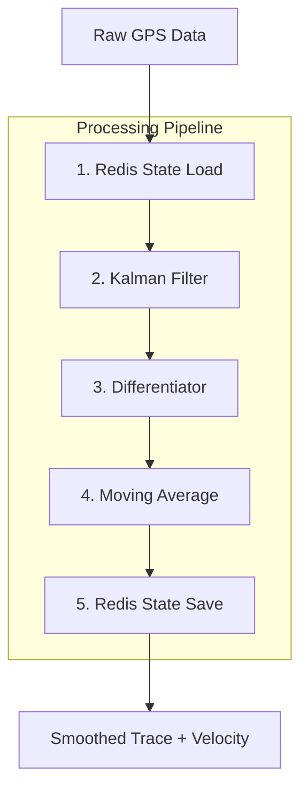

# GPS Trajectory Demo

Real-time GPS smoothing demonstration using **dspx** and Kalman filtering, based on the Microsoft Geolife GPS Trajectory Dataset.

## Architecture

This demo implements a **serverless processing pipeline** with 5 algorithmic steps:



### Pipeline Steps

1. **Redis State Load**: Retrieves previous Kalman filter state (covariance matrix, position, velocity buffer)
2. **Kalman Filter**: Smooths GPS coordinates using constant velocity model
3. **Differentiator**: Calculates instantaneous velocity from position changes
4. **Moving Average**: Smooths velocity to detect stops vs. movement
5. **Redis State Save**: Persists updated state for next iteration

## Features

- 🎯 **Kalman Filtering**: Removes GPS jitter (±10-50m noise)
- 📊 **Velocity Calculation**: Real-time speed estimation
- 🚗 **Stop Detection**: Identifies stationary periods
- 💾 **Stateless Architecture**: Redis-based state persistence for serverless deployment
- 🎨 **Interactive Visualization**: Toggle between raw and filtered traces
- ⚡ **Real-time Simulation**: Replay actual GPS trajectories

## Getting Started

### Installation

```bash
cd examples/gps-demo
npm install
```

### Running the Demo

**Quick Start:**

```bash
# Terminal 1: Start all services
npm run dev

# Terminal 2: Start data replay
npm run replay
```

**Access the demo at:** http://localhost:5173

📖 **[See QUICKSTART.md for detailed instructions](./QUICKSTART.md)**

### Dataset

Download the Microsoft Geolife GPS Trajectory Dataset from Kaggle:
https://www.kaggle.com/datasets/arashnic/microsoft-geolife-gps-trajectory-dataset

Place trajectory files in `./archive/`

## Algorithm Details

### Kalman Filter Configuration

- **Process Noise**: 0.1 (low - assumes smooth motion)
- **Measurement Noise**: 10.0 (GPS accuracy ±10 meters)
- **State Vector**: `[lat, lon, lat_velocity, lon_velocity]`
- **Model**: Constant velocity

### Velocity Smoothing

- **Window Size**: 5 samples
- **Method**: Simple moving average
- **Movement Threshold**: 0.5 m/s

### State Persistence

Binary serialization format:

- 4 doubles: state vector (lat, lon, v_lat, v_lon)
- 16 doubles: covariance matrix (4×4)
- 5 doubles: velocity buffer
- 1 int32: buffer index
- 1 double: timestamp

Total: 212 bytes per sensor

## Project Structure

```
gps-demo/
├── shared/           # Shared code between worker and client
│   ├── kalman-filter.ts    # Kalman filter implementation
│   ├── gps-pipeline.ts     # Complete processing pipeline
│   └── state-manager.ts    # Redis state management
├── worker/           # Serverless worker
│   └── gps-worker.ts       # Processes GPS points
├── client/           # Web visualization
│   ├── index.html
│   └── app.ts
└── archive/          # Geolife dataset
```

## Technology Stack

- **dspx**: DSP library for signal processing
- **Redis**: State persistence
- **TypeScript**: Type-safe development
- **Vite**: Fast development and bundling
- **Leaflet**: Map visualization (client)

## Performance

- **Latency**: <5ms per point (including Redis I/O)
- **State Size**: 212 bytes per sensor
- **Throughput**: 1000+ points/second per worker

## Use Cases

- Vehicle tracking
- Drone path smoothing
- Fitness tracking
- Asset monitoring
- Fleet management

## License

MIT
